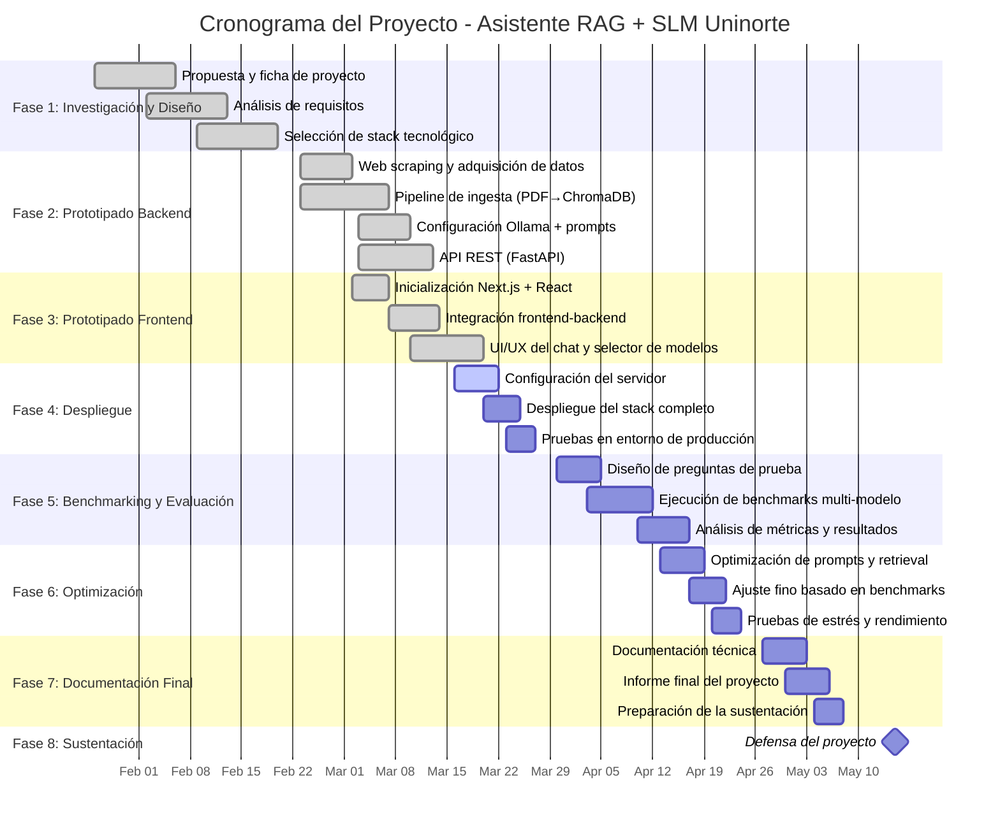

# ProyectoFinal-SLM-UNINORMA

# Informe 2: Asistente Virtual Basado en Small Language Model (SLM) para la Consulta de Normatividad de Uninorte

**Equipo:** Carlos Mendoza, Jesús De la Cruz, Juan José Aragón
**Docente:** Augusto Salazar
**Universidad del Norte — Semestre 2026-1**

---

## 1. Introducción

El acceso eficiente a la información institucional constituye un pilar fundamental en las instituciones de educación superior. En el contexto contemporáneo, la normatividad universitaria abarca estatutos, reglamentos estudiantiles, políticas académicas, resoluciones administrativas y acuerdos del consejo directivo, todos ellos dispersos en documentos PDF de decenas o centenas de páginas alojados en portales web de difícil navegación. Esta fragmentación impone una carga cognitiva significativa sobre los miembros de la comunidad académica —estudiantes, docentes y personal administrativo— quienes, ante una duda concreta, deben emprender búsquedas manuales de alto costo en tiempo y esfuerzo sin garantía de encontrar la información pertinente.

Con el advenimiento del Procesamiento de Lenguaje Natural (NLP) y, más recientemente, de los Modelos de Lenguaje Grande (LLMs), ha emergido un nuevo paradigma de interacción humano-computadora basado en interfaces conversacionales en lenguaje natural. Estos sistemas prometen eliminar la barrera entre el usuario y la información estructurada, transformando la experiencia de consulta en un diálogo fluido. Sin embargo, la adopción de LLMs comerciales a través de APIs de terceros plantea desafíos críticos en entornos institucionales: la privacidad de los datos consultados queda expuesta a proveedores externos, la dependencia de infraestructura en la nube genera costos operativos recurrentes y la naturaleza "caja negra" de estos servicios impide garantizar la trazabilidad y fidelidad de las respuestas generadas.

Para abordar estas problemáticas, el presente proyecto propone el diseño e implementación de UNINORMA, un asistente virtual inteligente basado en la arquitectura Retrieval-Augmented Generation (RAG) combinada con Small Language Models (SLMs) de ejecución local. La solución opera en modo 100% local (_on-premise_), empleando técnicas de cuantización de pesos para viabilizar el despliegue de modelos de miles de millones de parámetros en hardware de consumo estándar. Este informe documenta el estado actual del proyecto, abarcando los requerimientos definitivos, las decisiones de diseño y arquitectura adoptadas, la implementación funcional desarrollada y el plan de pruebas que guiará la validación del sistema.

---

## 2. Planteamiento del Problema

### 2.1. Descripción del Problema

La Universidad del Norte cuenta con un vasto corpus normativo compuesto por al menos 25 documentos institucionales activos, entre los cuales se incluyen el Reglamento Estudiantil de Pregrado, el Reglamento de Profesores, políticas de Propiedad Intelectual, normatividad de Bienestar Universitario, reglamentos de posgrado y resoluciones sobre derechos y deberes de la comunidad académica. Este acervo documental supera colectivamente varios cientos de páginas y se actualiza de forma periódica mediante resoluciones del Consejo Directivo, lo que dificulta mantener una versión unificada y accesible del conocimiento institucional.

El modelo actual de acceso a esta normatividad presenta deficiencias estructurales. Los portales web institucionales implementan motores de búsqueda léxica que identifican coincidencias de palabras clave sin comprender el contexto semántico de la consulta, fallando sistemáticamente frente a sinónimos, paráfrasis o preguntas formuladas en lenguaje coloquial. Adicionalmente, cuando el sistema sí localiza un documento pertinente, transfiere toda la carga interpretativa al usuario: este debe descargar el PDF, navegar por su estructura y extraer por sí mismo el fragmento que responde a su duda. Este proceso, que puede tomar entre 15 y 30 minutos para consultas no triviales, resulta especialmente problemático para estudiantes de primer año que aún no están familiarizados con el lenguaje jurídico-administrativo de los reglamentos.

La consecuencia más crítica de esta brecha de acceso es la desinformación activa: estudiantes que toman decisiones académicas (matricular asignaturas, solicitar retiros de materias, interponer recursos disciplinarios) con base en información incompleta o malinterpretada por no haber encontrado el artículo reglamentario pertinente. Se requiere, por tanto, un sistema capaz de comprender el lenguaje natural del usuario, recuperar los fragmentos exactos dentro del corpus normativo y sintetizar una respuesta coherente y citable, sin generar información que no esté respaldada por los documentos institucionales.

### 2.2. Restricciones y Supuestos de Diseño

Desde el punto de vista de la infraestructura computacional, la principal restricción del proyecto es la obligatoriedad de ejecución local (_on-premise_). La arquitectura no puede depender de servicios en la nube como OpenAI, Anthropic, Google Vertex AI o plataformas equivalentes para la fase de inferencia generativa, dado que esto implicaría transmitir consultas potencialmente sensibles de la comunidad académica a servidores externos. Esta restricción condiciona directamente la selección del modelo generativo, limitándola a modelos que puedan operar dentro de la memoria RAM/VRAM disponible en hardware de grado consumidor. En la práctica, esto se traduce en el uso del modelo Qwen 2.5:3b (3.1 miles de millones de parámetros) bajo cuantización Q4_K_M a través del motor de inferencia Ollama, cuya huella de memoria en tiempo de ejecución es de aproximadamente 3.5 GB.

En cuanto a restricciones de diseño de software, el sistema está concebido como un prototipo funcional de validación académica y no como un sistema de producción a escala universitaria. Esto implica que el servidor de inferencia (Ollama) maneja las solicitudes de forma secuencial —sin paralelismo de instancias del modelo—, lo que establece un cuello de botella de rendimiento frente a cargas concurrentes simultáneas. Asimismo, la veracidad de las respuestas está acotada por el alcance del corpus ingresado: el sistema no debe, bajo ninguna circunstancia, generar respuestas basadas en conocimiento paramétrico externo al corpus; toda afirmación debe estar fundamentada en los fragmentos recuperados por el componente de recuperación semántica.

Los supuestos fundamentales bajo los cuales se plantea la solución son los siguientes: (a) el corpus documental de 25 fuentes —20 PDFs y 5 páginas web— procesado en 907 fragmentos (_chunks_) constituye una muestra representativa y suficiente de la normatividad activa de la institución para los propósitos de validación del prototipo; (b) los usuarios finales interactuarán con el sistema utilizando exclusivamente el idioma español, lo cual justifica la selección de un modelo de _embeddings_ multilingüe con énfasis en representaciones del español; y (c) el entorno de despliegue contará con un mínimo de 8 GB de RAM, 2 núcleos de CPU y 20 GB de espacio en disco, conforme a los requerimientos documentados del stack tecnológico seleccionado.

### 2.3. Alcance

El proyecto comprende el ciclo de vida completo de una solución de software de inteligencia artificial conversacional, desde la adquisición y procesamiento de datos hasta el despliegue en contenedores. En cuanto a la capa de datos, el alcance incluye la construcción de un pipeline automatizado de ingesta que realiza _web scraping_ del portal normativo de la Universidad del Norte, extrae texto de documentos PDF (incluyendo PDFs escaneados mediante OCR), aplica una estrategia de segmentación semántica (_chunking_ recursivo con solapamiento) y genera representaciones vectoriales densas mediante un modelo de _embeddings_ multilingüe, almacenándolas en una base de datos vectorial local (ChromaDB).

En cuanto a los componentes técnicos del sistema, el alcance abarca el desarrollo de una API RESTful en FastAPI que expone los endpoints de consulta, gestión de modelos y verificación de estado del sistema; la integración con el motor de inferencia local Ollama para la ejecución del modelo generativo Qwen 2.5:3b; la orquestación del flujo RAG mediante LangChain (LCEL); y el desarrollo de una interfaz de usuario web moderna construida en Next.js 16 con React 19 y Tailwind CSS. Adicionalmente, se incluye un módulo de _benchmarking_ con más de 40 preguntas de prueba categorizadas por dificultad y área normativa, junto con métricas de evaluación de recuperación, relevancia y fidelidad.

Fuera del alcance de esta propuesta se encuentran los siguientes aspectos: la integración del asistente con los sistemas de información core de la Universidad del Norte (SIS académico, portales de autogestión, plataformas LMS), dado que esto requeriría acuerdos institucionales que exceden el marco de un proyecto de pregrado; el soporte para idiomas distintos al español; la implementación de mecanismos de autenticación y control de acceso por roles; y la continuidad de sesión multiturno persistente entre distintas sesiones de usuario. El sistema tampoco proporciona asesoría legal vinculante: sus respuestas tienen carácter exclusivamente informativo.

---

## 3. Objetivos

### 3.1. Objetivo General

Diseñar e implementar un asistente virtual inteligente basado en la arquitectura de Generación Aumentada por Recuperación (RAG) y Modelos de Lenguaje Reducidos (SLM) de ejecución local, que facilite la consulta en lenguaje natural de la normatividad institucional de la Universidad del Norte, garantizando respuestas precisas, citadas y libres de alucinaciones informativas.

### 3.2. Objetivos Específicos

Los objetivos específicos operacionalizan el objetivo general en entregables concretos y medibles, articulados en torno a los componentes funcionales del sistema:

- **OE1 — Pipeline de Ingesta:** Desarrollar un pipeline automatizado de adquisición, extracción y procesamiento de datos no estructurados (PDFs y HTML) que permita la segmentación semántica (_chunking_ recursivo con solapamiento de 200 tokens sobre ventanas de 1.000 tokens) y la representación vectorial del corpus normativo institucional mediante el modelo `paraphrase-multilingual-MiniLM-L12-v2`.

- **OE2 — Motor de Búsqueda Semántica:** Implementar un motor de recuperación semántica utilizando ChromaDB con búsqueda por similitud del coseno, configurado para retornar los 6 fragmentos (_Top-K = 6_) con mayor similitud semántica a la consulta del usuario, optimizado para el vocabulario jurídico-administrativo del contexto colombiano.

- **OE3 — Integración del SLM:** Integrar y configurar el modelo Qwen 2.5:3b ejecutado localmente mediante Ollama, aplicando técnicas de _prompt engineering_ para restringir estrictamente la generación al contexto recuperado y mitigar las alucinaciones en un entorno RAG cerrado, con temperatura de inferencia de 0.1.

- **OE4 — API y Orquestación RAG:** Construir una API RESTful escalable en FastAPI que orqueste el flujo completo de inferencia mediante LangChain LCEL, exponiendo los _endpoints_ de consulta (`/query`), gestión de modelos (`/models`, `/models/load`) y verificación de estado (`/health`).

- **OE5 — Interfaz de Usuario:** Desarrollar una interfaz de usuario web moderna en Next.js 16 con React 19 y Tailwind CSS, que permita la interacción fluida con el asistente, la visualización de fuentes citadas y la selección dinámica del modelo SLM activo.

- **OE6 — Evaluación y Benchmarking:** Diseñar y ejecutar un plan de evaluación cuantitativa con un conjunto de más de 40 preguntas de prueba categorizadas, midiendo métricas de recuperación (_retrieval hit rate_), relevancia de respuesta (_answer relevancy_), fidelidad al contexto (_faithfulness_) y detección de alucinaciones, comparando el desempeño de al menos tres modelos SLM distintos.

El cumplimiento de estos objetivos se verifica de forma objetiva a través de los criterios de aceptación definidos en el plan de pruebas: una tasa de recuperación correcta superior al 85% en el Top-3 de resultados para el conjunto de validación, un tiempo de respuesta inferior a 8 segundos para el inicio del _streaming_ de tokens en el entorno local de referencia, y la capacidad de rechazar correctamente consultas fuera del dominio normativo institucional.

---

## 4. Estado del Arte

En el panorama actual de soluciones para asistentes virtuales orientados a consultas institucionales en educación superior, pueden identificarse tres categorías principales. La primera corresponde a las plataformas comerciales de chatbots universitarios, como Engageware (anteriormente Mongoose Harmony), Ivy.ai y Ada CX, que ofrecen soluciones SaaS preconfiguradas para responder preguntas frecuentes de estudiantes. Estas herramientas se integran con los sistemas de información universitarios y proporcionan una experiencia conversacional aceptable para consultas de alto nivel (fechas de matrícula, requisitos de admisión, localización de oficinas), pero presentan limitaciones estructurales para consultas normativas precisas: su base de conocimiento depende de la carga manual de contenidos por parte de administradores, no son capaces de razonar sobre documentos PDF no estructurados y operan exclusivamente sobre infraestructura en la nube del proveedor, lo que compromete la soberanía de los datos institucionales.

La segunda categoría comprende las soluciones basadas en APIs de LLMs comerciales (OpenAI GPT-4, Google Gemini, Anthropic Claude), que han demostrado capacidades conversacionales excepcionales. Proyectos como "ChatPDF" o los asistentes de estudio basados en ChatGPT han explorado el uso de estas APIs para responder preguntas sobre documentos específicos. Sin embargo, para el contexto de una institución universitaria colombiana, esta aproximación enfrenta obstáculos significativos: (a) los costos por token de inferencia escalan con el volumen de consultas, generando un gasto operativo recurrente incompatible con presupuestos académicos; (b) toda consulta transmitida a la API es procesada en servidores externos, lo que puede constituir una vulneración de políticas de privacidad de datos institucionales; (c) estos modelos generan respuestas basadas en su conocimiento paramétrico general, con alta propensión a alucinaciones cuando se les consulta sobre normativas específicas que no fueron parte de su entrenamiento.

La tercera categoría, y la más relevante para este proyecto, corresponde a los marcos de trabajo RAG (_Retrieval-Augmented Generation_) locales. Soluciones como **PrivateGPT** y **AnythingLLM** han popularizado la idea de ejecutar pipelines RAG completamente _on-premise_, utilizando modelos de código abierto cuantizados. PrivateGPT, en su versión de código abierto, implementa un stack similar al de este proyecto (LlamaCpp + ChromaDB + sentence-transformers) pero con una interfaz mínima y sin soporte para múltiples modelos simultáneos. AnythingLLM ofrece una experiencia de usuario más pulida, pero está concebida como una herramienta de propósito general, sin optimizaciones para vocabularios jurídico-administrativos en español ni capacidad de ingesta automatizada mediante _web scraping_. La comparación con estas soluciones revela la oportunidad diferenciadora de UNINORMA: una solución especializada en el corpus normativo concreto de la Universidad del Norte, con un pipeline de ingesta automático, soporte multimodelo y _benchmarking_ cuantitativo integrado.

Desde la perspectiva del modelado del lenguaje, la literatura reciente (2023–2025) ha documentado que modelos en el rango de 1B a 7B de parámetros, cuando se especializan mediante RAG sobre un dominio cerrado, pueden igualar el rendimiento de modelos significativamente más grandes en tareas de razonamiento deductivo acotado. El modelo Qwen 2.5:3b, desarrollado por Alibaba Cloud, ha demostrado un rendimiento superior en tareas de comprensión lectora en español frente a alternativas de tamaño equivalente como Llama 3.2:3b o Phi-3 Mini, lo que justifica su selección como modelo primario para este prototipo. La cuantización Q4_K_M (reducción de precisión de coma flotante de 16 bits a enteros de 4 bits mediante el formato GGUF) permite reducir la huella de memoria del modelo de ~6 GB a ~2 GB sin una degradación perceptible de la perplejidad en tareas de razonamiento sobre texto en español.

---

## 5. Requerimientos

### 5.1. Requerimientos Funcionales

Los requerimientos funcionales definen el comportamiento observable del sistema desde la perspectiva del usuario final y de los operadores del sistema. Su definición parte del análisis de los flujos de uso primarios identificados durante la fase de diseño: la consulta de información normativa en lenguaje natural, la visualización de fuentes, la selección de modelo y el monitoreo del estado del sistema.

| ID | Descripción | Prioridad |
|----|-------------|-----------|
| RF01 | El sistema debe aceptar y procesar consultas escritas en lenguaje natural en español, sin requerir que el usuario conozca palabras clave específicas o la estructura de los documentos. | Alta |
| RF02 | El sistema debe generar respuestas basadas exclusivamente en los fragmentos recuperados del corpus normativo pre-cargado, sin incorporar conocimiento paramétrico externo del modelo generativo. | Alta |
| RF03 | El sistema debe mostrar junto a cada respuesta las fuentes de información utilizadas, indicando el nombre del documento y el número de página correspondiente. | Alta |
| RF04 | El sistema debe exponer un endpoint de consulta (`POST /query`) que acepte la pregunta del usuario y el identificador del modelo SLM a utilizar, retornando la respuesta y las fuentes en formato JSON. | Alta |
| RF05 | El sistema debe permitir la selección dinámica del modelo SLM activo a través de un endpoint de gestión (`POST /models/load`) sin necesidad de reiniciar el servicio. | Media |
| RF06 | El sistema debe exponer un endpoint de estado (`GET /health`) que informe en tiempo real sobre la disponibilidad del motor de inferencia Ollama, la disponibilidad de la base de datos vectorial y el modelo activo. | Media |
| RF07 | Cuando la consulta del usuario no tenga correspondencia en el corpus normativo, el sistema debe responder explícitamente que no cuenta con información institucional sobre ese tema, en lugar de generar una respuesta inventada. | Alta |
| RF08 | El sistema debe transmitir la respuesta generada mediante _streaming_ de tokens para reducir la latencia percibida por el usuario. | Media |

Los requerimientos RF01, RF02, RF03 y RF07 constituyen el núcleo funcional del sistema y son condición necesaria para que el asistente sea considerado correcto y útil en el contexto normativo universitario. Su incumplimiento no es aceptable en ninguna fase de despliegue. Los requerimientos RF05 y RF08 son de prioridad media y están orientados a mejorar la experiencia de uso durante la fase de benchmarking, donde se evaluarán múltiples modelos SLM de forma comparativa.

### 5.2. Requerimientos No Funcionales

Los requerimientos no funcionales definen los atributos de calidad que determinan la idoneidad del sistema más allá de sus funcionalidades específicas. En el caso de UNINORMA, estos atributos son particularmente críticos dado el contexto _on-premise_ y las restricciones de hardware bajo las cuales opera el sistema.

| ID | Categoría | Descripción |
|----|-----------|-------------|
| RNF01 | Privacidad | Toda la arquitectura (base de datos vectorial, motor LLM, API, interfaz) debe ejecutarse localmente sin transmitir datos a servicios externos durante la fase de inferencia. |
| RNF02 | Rendimiento | El tiempo total de respuesta (desde el envío de la consulta hasta el inicio del _streaming_ de tokens) no debe superar los 8 segundos en el entorno de referencia (8 GB RAM, 4 CPU cores). |
| RNF03 | Portabilidad | El sistema completo debe desplegarse mediante un único comando (`docker compose up`) sin configuración manual de dependencias en el sistema operativo anfitrión. |
| RNF04 | Mantenibilidad | La arquitectura debe permitir la sustitución del modelo SLM o de la base de datos vectorial sin modificar la capa de presentación ni la lógica de orquestación RAG, conforme al principio de bajo acoplamiento. |
| RNF05 | Escalabilidad | El sistema debe soportar la adición de nuevos documentos al corpus mediante re-ejecución del pipeline de ingesta, sin necesidad de modificar código fuente. |
| RNF06 | Seguridad | La API no debe exponer información sobre la estructura interna del sistema (rutas de archivos, versiones de dependencias, trazas de error completas) en las respuestas HTTP de error. |

El cumplimiento de RNF01 es una restricción no negociable derivada del contexto institucional del proyecto. RNF03 garantiza la reproducibilidad del sistema en diferentes entornos de despliegue (entorno de desarrollo local, cluster universitario, nube privada), lo cual es esencial para la evaluación académica del proyecto. La arquitectura modular descrita en la sección de Diseño y Arquitectura ha sido diseñada explícitamente para satisfacer RNF04: la estandarización a través de las abstracciones de LangChain permite sustituir ChromaDB por Milvus o Qdrant, o reemplazar Qwen por cualquier modelo compatible con Ollama, sin modificar el pipeline RAG ni la interfaz de usuario.

---

## 6. Diseño y Arquitectura

### 6.1. Evaluación de Alternativas

Para cada decisión tecnológica clave del sistema, se evaluaron múltiples alternativas conforme a criterios de privacidad, costo operativo, rendimiento en hardware de consumo y compatibilidad con el ecosistema Python/JavaScript del equipo. Esta evaluación constituye la justificación técnica de las elecciones de diseño adoptadas y es fundamental para comprender las compensaciones (_trade-offs_) que la arquitectura final implica.

**Bases de datos vectoriales:** Se evaluaron Pinecone, Weaviate, Milvus y ChromaDB. Pinecone y Weaviate fueron descartadas inmediatamente al ser servicios en la nube, lo que viola la restricción de privacidad RNF01. Milvus, aunque de código abierto y desplegable localmente, requiere una infraestructura dedicada (servidor independiente, configuración de clúster) que excede la complejidad operativa aceptable para un prototipo académico. ChromaDB fue seleccionada por ser una base de datos vectorial embebida que opera en el mismo proceso que la aplicación Python, sin requerir un servidor separado, con soporte nativo para persistencia en disco y una API limpia para la integración con LangChain.

**Modelos de lenguaje:** Se evaluaron tres enfoques: APIs comerciales (OpenAI GPT-4, Google Gemini, Anthropic Claude), modelos locales de alto parámetro (Llama 3.1:70b, Mixtral 8x7b) y SLMs cuantizados (Qwen 2.5:3b, Llama 3.2:3b, Phi-3 Mini). Las APIs comerciales fueron descartadas por las razones expuestas en el Estado del Arte (privacidad y costo). Los modelos de alto parámetro, aunque superiores en capacidad de razonamiento, requieren entre 40 y 80 GB de VRAM para inferencia eficiente, lo que los hace inviables en hardware de consumo. Entre los SLMs cuantizados, Qwen 2.5:3b fue seleccionado por su superior desempeño en tareas de comprensión lectora en español frente a Llama 3.2:3b y Phi-3 Mini en evaluaciones preliminares, manteniendo una huella de memoria de ~2 GB bajo cuantización Q4_K_M.

**Frameworks de orquestación y frontend:** Para la orquestación RAG, se evaluaron LangChain, LlamaIndex y una implementación manual del pipeline. LlamaIndex es igualmente competente, pero LangChain fue seleccionado por la mayor madurez de su ecosistema, la expresividad de su API declarativa (LCEL) y la mayor cantidad de recursos de documentación en español. Para el frontend, se evaluaron Vue.js/Nuxt 3, Angular y Next.js 16; Next.js fue seleccionado por su soporte nativo para Server Components, la facilidad de implementar un proxy inverso hacia el backend sin servidor adicional (mediante el sistema de rutas de API) y la compatibilidad con React 19, que reduce la curva de aprendizaje dado el conocimiento previo del equipo con el ecosistema React.

| Decisión | Alternativas evaluadas | Selección | Criterio determinante |
|----------|----------------------|-----------|----------------------|
| Vector Store | Pinecone, Weaviate, Milvus, **ChromaDB** | ChromaDB | Embebido, local, sin servidor externo |
| LLM | GPT-4 API, Llama 3.1:70b, **Qwen 2.5:3b** | Qwen 2.5:3b | Rendimiento en español, huella < 4 GB |
| Embedding | OpenAI ada-002, **MiniLM-L12-v2**, mpnet-base-v2 | MiniLM-L12-v2 | Multilingüe, local, latencia baja |
| Orquestación RAG | LlamaIndex, Manual, **LangChain LCEL** | LangChain | Ecosistema maduro, bajo acoplamiento |
| Backend API | Django, Flask, **FastAPI** | FastAPI | Async nativo, OpenAPI automático, Pydantic |
| Frontend | Vue/Nuxt, Angular, **Next.js 16** | Next.js | Proxy API nativo, React 19, SSR |

### 6.2. Arquitectura del Sistema

El sistema adopta una arquitectura cliente-servidor orientada a microservicios en un entorno de ejecución 100% local (_Local-first / On-Premise_). El desacoplamiento entre componentes se logra mediante el uso de las abstracciones de LangChain como capa de orquestación intermedia, lo que permite la sustitución independiente de cualquier componente sin afectar al resto de la arquitectura.

**Diagrama de Arquitectura del Sistema:**

**Componentes del sistema e interacción:**

El sistema se divide en los siguientes componentes principales:

- **Frontend (Next.js 16, React 19, Tailwind CSS):** Actúa como la capa de presentación. Su responsabilidad es capturar la consulta del usuario en lenguaje natural, renderizar el flujo de tokens de respuesta mediante _streaming_ y mostrar los metadatos de las fuentes recuperadas. Incluye un proxy reverso transparente hacia el backend que evita problemas de CORS y abstrae la topología de red interna.

- **API Core / Backend (FastAPI + Uvicorn):** Expone los _endpoints_ RESTful. Es responsable de la recepción de solicitudes HTTP, la validación de _payloads_ mediante modelos Pydantic, el manejo de errores y el enrutamiento interno hacia el orquestador RAG.

- **Orquestador RAG (LangChain LCEL):** Componente _middleware_ responsable de la lógica central del pipeline. Se encarga de instanciar el modelo de _embeddings_, construir el _System Prompt_ inyectando los fragmentos recuperados y componer la cadena `Retriever → PromptTemplate → LLM → StrOutputParser` mediante sintaxis LCEL.

- **Base de Datos Vectorial (ChromaDB):** Su responsabilidad exclusiva es el almacenamiento persistente de los vectores densos generados en la fase de ingesta y la ejecución eficiente de búsquedas por similitud del coseno. La colección `uninorte_normatividad` contiene 907 fragmentos vectorizados.

- **Motor de Inferencia LLM (Ollama + Qwen 2.5:3b):** Servicio responsable de ejecutar el modelo cuantizado (Q4_K_M) y generar la respuesta en lenguaje natural basada estrictamente en el contexto entregado por el orquestador RAG. Opera como un servidor REST interno accesible en el puerto 11434.

**Diagrama de Secuencia:**

**Flujo de interacción entre módulos:**

1. El **Frontend** envía la consulta del usuario mediante una petición `POST /api/query` al proxy Next.js.
2. El proxy reenvía la solicitud al **Backend (FastAPI)** en `POST /query`.
3. El Backend delega el control al **Orquestador (LangChain)**, que transforma el texto en un vector denso mediante el modelo de _embeddings_ cargado en memoria.
4. LangChain consulta a **ChromaDB** mediante búsqueda de similitud del coseno, extrayendo el Top-6 de fragmentos normativos más relevantes.
5. LangChain ensambla el _prompt_ estructurado (sistema + contexto + pregunta) y lo transmite al **Motor Ollama**.
6. Ollama retorna los tokens generados mediante _streaming_; el flujo atraviesa la arquitectura de regreso hasta el Frontend, donde se renderiza progresivamente.

---

## 7. Implementación

### 7.1. Stack Tecnológico

El backend del sistema está construido sobre **Python 3.11** como lenguaje principal, utilizando **FastAPI 0.100+** como framework web asíncrono y **Uvicorn** como servidor ASGI de alto rendimiento. La selección de Python está motivada por la madurez de su ecosistema para aplicaciones de inteligencia artificial: las librerías de NLP, _embeddings_, bases de datos vectoriales y orquestación de LLMs más relevantes tienen Python como lenguaje de referencia. Para la orquestación del pipeline RAG, se utiliza **LangChain 0.2+** en su variante LCEL, lo que permite expresar el flujo completo como una cadena declarativa de componentes componibles. La gestión de embeddings se delega a **sentence-transformers 2.2+** (HuggingFace), que descarga y ejecuta el modelo `paraphrase-multilingual-MiniLM-L12-v2` localmente durante la primera inicialización del contenedor. La extracción de texto de PDFs se realiza mediante **LiteParse**, un extractor local con capacidad de OCR como mecanismo de respaldo para documentos escaneados.

El frontend está construido sobre **Next.js 16.1.6** con **React 19.2.3** y **TypeScript 5**, utilizando **Tailwind CSS 4** para el estilado. La arquitectura del frontend sigue el patrón App Router de Next.js 16, donde los componentes del servidor y del cliente coexisten en la misma estructura de directorios. El proxy inverso hacia el backend está implementado como una ruta de API de Next.js (`app/api/[...proxy]/route.ts`), lo que permite que el frontend se comunique con el backend sin exponer la URL interna del servicio al navegador del cliente. El _streaming_ de tokens se implementa mediante la API nativa `ReadableStream` del navegador, consumida desde los _Server Components_ de Next.js.

La infraestructura de despliegue está completamente contenedorizada mediante **Docker** y orquestada con **Docker Compose 3.8**. El `docker-compose.yml` define tres servicios: `ollama` (imagen oficial `ollama/ollama:latest`), `backend` (imagen construida desde `Prototipo/Dockerfile` sobre `python:3.11-slim`) y `frontend` (imagen construida con _build_ de dos etapas desde `node:20-alpine`). El volumen `ollama_models` persiste los pesos del modelo LLM entre reinicios del contenedor. El sistema completo requiere un mínimo de 8 GB de RAM, distribuyéndose aproximadamente en 3.5 GB para Ollama + Qwen 2.5:3b, 600 MB para FastAPI + ChromaDB y 200 MB para el servidor Next.js.

### 7.2. Componentes

El backend está organizado en una capa de módulos bajo el directorio `src/`, cada uno con una responsabilidad única y bien delimitada:

- **`web_scraper.py`:** Realiza la adquisición automatizada de contenido desde el portal normativo de la Universidad del Norte. Implementa una sesión HTTP con reintentos (3 intentos, _backoff_ de 0.5s), _User-Agent_ de Chrome 120 para compatibilidad con el CMS Liferay de la institución, y manejo de tres tipos de contenido: enlaces directos a PDFs, subpáginas con PDFs y páginas HTML sin PDF asociado. El módulo detecta automáticamente el tipo de contenido y aplica la estrategia de extracción correspondiente.

- **`pdf_extractor.py`:** Extrae el contenido textual de los PDFs descargados mediante LiteParse. Implementa una estrategia en dos pasos: primero intenta extracción sin OCR (para PDFs con texto seleccionable); si el resultado contiene menos de 50 caracteres, activa el modo OCR para documentos escaneados. El texto extraído es sometido a un proceso de limpieza que normaliza espacios, elimina encabezados y pies de página repetitivos y corrige problemas de codificación de caracteres especiales del español.

- **`text_chunker.py`:** Aplica la estrategia `RecursiveCharacterTextSplitter` de LangChain con ventanas de 1.000 tokens y solapamiento de 200 tokens. Los separadores se aplican en orden jerárquico (`["\n\n", "\n", ". ", " ", ""]`), priorizando los saltos de párrafo para preservar la coherencia semántica. A cada chunk se le adjunta metadatos que incluyen el nombre del archivo fuente, el título del documento, el número de página y el índice secuencial del fragmento, garantizando la trazabilidad necesaria para la citación de fuentes.

- **`embeddings.py` + `vector_store.py`:** El primero instancia y gestiona el modelo de embeddings HuggingFace, exponiendo una interfaz unificada compatible con LangChain. El segundo encapsula todas las operaciones sobre ChromaDB: inicialización de la colección, ingesta de documentos con sus vectores y metadatos, y creación del objeto `Retriever` configurado para búsqueda por similitud del coseno con Top-K=6.

- **`rag_chain.py`:** Compone la cadena LCEL completa: `{"context": retriever | format_docs, "question": RunnablePassthrough()} | prompt_template | ollama_llm | StrOutputParser()`. Implementa deduplicación de fuentes antes del retorno y formatea los metadatos de cada fragmento recuperado para su presentación al usuario.

- **`api.py`:** Define los cuatro _endpoints_ FastAPI del sistema (`/health`, `/models`, `/models/load`, `/query`), los modelos Pydantic de request/response, y el middleware de CORS. El _endpoint_ `/query` invoca la cadena RAG de forma síncrona y retorna la respuesta completa en formato JSON incluyendo `answer`, `sources` y `model`.

El frontend está organizado en cuatro componentes React reutilizables: `ChatMessage.tsx` (renderiza mensajes con animación de escritura para el estado de carga), `ModelSelector.tsx` (desplegable dinámicamente poblado desde `/models`), `SourceCard.tsx` (muestra fuentes como _chips_ con nombre de documento y página) y `StatusBar.tsx` (indicadores de estado del sistema mediante consultas periódicas a `/health`).

### 7.3. Integraciones

La integración más crítica del sistema es la comunicación entre el backend Python y el motor de inferencia **Ollama**. Esta integración se realiza mediante el cliente HTTP oficial de Ollama para Python (`ollama>=0.1.0`), que abstrae las llamadas REST al servidor Ollama (puerto 11434). El módulo `ollama_client.py` gestiona el ciclo de vida de los modelos: verifica su disponibilidad, los carga en memoria si no están activos y expone métodos de generación con parámetros configurables (temperatura=0.1, max_tokens=2048). En el entorno Dockerizado, Ollama se ejecuta en un contenedor separado y el backend se conecta a él mediante la URL de servicio interna `http://ollama:11434`, parametrizable mediante la variable de entorno `OLLAMA_BASE_URL`.

La integración con **ChromaDB** es de tipo embebido: la base de datos vectorial se instancia directamente en el proceso Python del backend, leyendo y escribiendo en el directorio `data/chroma_db/` del sistema de archivos del contenedor. Esta arquitectura sin servidor elimina la latencia de red en las operaciones de recuperación semántica, reduciendo el tiempo de búsqueda del Top-K a menos de 50 ms para una colección de 907 vectores. La comunicación entre LangChain y ChromaDB se realiza mediante el adaptador `langchain-community`, que expone la interfaz `Retriever` estándar de LangChain, lo que preserva el bajo acoplamiento de la arquitectura.

La integración con **HuggingFace** para el modelo de embeddings ocurre en el momento de construcción del contenedor Docker del backend: el `Dockerfile` ejecuta un script de precarga del modelo `paraphrase-multilingual-MiniLM-L12-v2` durante la fase de _build_, evitando descargas en tiempo de ejecución. Esto garantiza que el sistema arranque en modo _offline_ completo una vez que la imagen Docker ha sido construida. El pipeline de ingesta se integra adicionalmente con el portal web de la Universidad del Norte mediante las dependencias `requests>=2.28.0` y `beautifulsoup4>=4.12.0`, utilizando selectores CSS específicos del CMS Liferay (`div.journal-content-article`, `div.c_cr`, `article`) para extraer el contenido relevante de las páginas de normatividad.

---

## 8. Plan de Pruebas

### 8.1. Pruebas por Componentes

El plan de pruebas por componentes tiene como objetivo verificar el correcto funcionamiento de cada módulo del sistema de forma aislada, identificando defectos antes de que se propaguen a las capas superiores de la arquitectura. Para el módulo `pdf_extractor.py`, las pruebas unitarias verifican tres casos: la extracción correcta de texto seleccionable (PDF digital), la activación y correcto funcionamiento del modo OCR ante PDFs escaneados (condición: texto extraído < 50 caracteres sin OCR), y la correcta limpieza del texto resultante (normalización de espacios, eliminación de artefactos de codificación). El criterio de éxito es la extracción del 100% del contenido textual esperado para un conjunto de documentos de referencia con _ground truth_ conocido.

Para el módulo `text_chunker.py`, las pruebas unitarias validan que: (a) el número de chunks generados para un documento de texto conocido sea consistente con los parámetros de ventana (1.000 tokens) y solapamiento (200 tokens); (b) los metadatos adjuntos a cada chunk contengan los campos requeridos (`source`, `title`, `page`, `chunk_index`); y (c) no se generen chunks con longitud cero ni chunks que excedan el tamaño máximo configurado. Para el módulo `embeddings.py`, se verifica que el vector generado para una consulta de prueba tenga la dimensionalidad correcta (384 dimensiones para `MiniLM-L12-v2`) y que la similitud del coseno entre embeddings de frases semánticamente similares sea significativamente mayor que entre frases no relacionadas.

Para el módulo `rag_chain.py`, las pruebas unitarias utilizan un conjunto de contextos inyectados de forma artificial (sin invocar ChromaDB ni Ollama reales) para verificar el comportamiento del _prompt template_ y el _parser_ de salida. Se prueba específicamente el caso en que el contexto recuperado no contiene información relevante: el sistema debe generar la respuesta de rechazo predefinida en lugar de intentar sintetizar una respuesta vacía o incorrecta. El módulo `benchmark/metrics.py` es también sometido a pruebas unitarias que verifican la correcta implementación de las métricas de evaluación (_retrieval hit rate_, _answer relevancy_, _faithfulness_) contra valores calculados manualmente para un conjunto pequeño de casos de prueba conocidos.

### 8.2. Pruebas de Integración

Las pruebas de integración verifican la interacción correcta entre los componentes del sistema a través de sus interfaces definidas, con especial énfasis en los flujos de datos extremo a extremo. El módulo de _benchmarking_ (`benchmark/run_benchmark.py`) constituye el principal instrumento de prueba de integración: ejecuta las 40+ preguntas del archivo `test_questions.json` contra el sistema completo (ChromaDB + LangChain + Ollama) y mide las métricas de recuperación y generación. Cada pregunta en el conjunto de prueba tiene asociado un `expected_source` (el documento correcto del cual debe recuperarse información), una `category` (área normativa) y un nivel de `difficulty` (fácil, medio, difícil). El criterio de éxito de las pruebas de integración del pipeline RAG es una tasa de recuperación correcta (_retrieval hit rate_) superior al 85% en el Top-3 de resultados.

Para los _endpoints_ de la API, las pruebas de integración verifican los cuatro _endpoints_ expuestos por FastAPI mediante solicitudes HTTP reales contra el servidor en ejecución. El _endpoint_ `GET /health` debe retornar un objeto JSON con `ollama_running: true`, `vector_store_ready: true` y el nombre del modelo activo cuando el sistema está correctamente inicializado. El _endpoint_ `POST /query` es sometido a pruebas con un conjunto representativo de preguntas reales, verificando que: la respuesta no esté vacía, las fuentes retornadas correspondan a documentos del corpus, el campo `model` refleje el modelo efectivamente utilizado, y el tiempo de respuesta total sea inferior a 8 segundos. También se prueba el comportamiento ante _payloads_ malformados (campo `question` vacío, `model` no reconocido) para verificar que la API retorne códigos HTTP de error apropiados (400, 422) sin exponer trazas internas.

Las pruebas de integración también incluyen la verificación del flujo de carga y descarga de modelos mediante el _endpoint_ `POST /models/load`. Se verifica que, tras solicitar la carga de un modelo alternativo (ej. `llama3.2:3b`), las siguientes consultas sean efectivamente atendidas por ese modelo, y que el _endpoint_ `/health` refleje el cambio. El pipeline completo de ingesta es igualmente sometido a pruebas de integración: se ejecuta el script `ingest.py` sobre un subconjunto controlado de documentos y se verifica que el número de chunks indexados en ChromaDB sea consistente con el total esperado, que los metadatos de todos los chunks sean correctos y que el motor de recuperación devuelva resultados relevantes para preguntas de control.

### 8.3. Pruebas de Usabilidad

Las pruebas de usabilidad tienen como objetivo evaluar la efectividad del sistema desde la perspectiva del usuario final —estudiantes y miembros de la comunidad académica de la Universidad del Norte—, más allá de la corrección técnica verificada en las pruebas anteriores. La metodología adoptada es una evaluación heurística combinada con pruebas de pensamiento en voz alta (_think-aloud protocol_): se reclutará un grupo de al menos 8 participantes representativos del usuario objetivo (estudiantes de diferentes programas académicos, con distinto nivel de familiaridad con herramientas digitales) para realizar un conjunto de tareas de consulta normativa predefinidas utilizando el asistente.

Las tareas de evaluación incluirán consultas de distinto nivel de complejidad: preguntas directas sobre artículos específicos del Reglamento Estudiantil (ej. "¿Cuántos créditos debo cursar para ser considerado estudiante de tiempo completo?"), preguntas que requieren sintetizar información de múltiples fuentes (ej. "¿Cuáles son los requisitos para solicitar un retiro de materia en el período de parciales?") y preguntas deliberadamente fuera del dominio normativo (ej. "¿Cuándo es el próximo partido de la selección colombiana?") para evaluar el comportamiento de rechazo del sistema. Para cada tarea, se medirán: el tiempo de completación (desde el envío de la consulta hasta que el usuario confirma haber obtenido la información buscada), el número de consultas reformuladas necesarias para obtener una respuesta satisfactoria y la puntuación de satisfacción en una escala de 1 a 5 (System Usability Scale adaptada).

Los criterios de aceptación de las pruebas de usabilidad son: (a) al menos el 75% de los participantes debe ser capaz de formular su consulta en lenguaje natural sin necesitar instrucciones adicionales sobre la sintaxis o el formato de las preguntas; (b) la puntuación media de satisfacción debe superar 3.5/5.0 en la escala de usabilidad adaptada; (c) el sistema debe rechazar correctamente el 100% de las consultas fuera del dominio normativo en el grupo de prueba, sin generar respuestas inventadas; y (d) al menos el 80% de las respuestas provistas deben incluir referencias a documentos que los participantes consideren relevantes para la consulta realizada. Los resultados de estas pruebas alimentarán la fase de optimización de _prompts_ y parámetros de recuperación planificada para las semanas 12–13 del cronograma.

---

## 9. Cronograma de Trabajo

**Equipo:** Carlos Mendoza, Jesús De la Cruz, Juan José Aragón
**Periodo:** Semestre 2026-1 (Ene 26 – May 15, 16 semanas) | Sustentación: May–Jun 2026

### Detalle por fase

| Fase | Semanas | Periodo | Actividades | Estado | Responsable |
|------|---------|---------|-------------|--------|-------------|
| **1. Investigación y Diseño** | 1–4 | Ene 26 – Feb 20 | Propuesta de proyecto, ficha, análisis de requisitos, selección de tecnologías (Ollama, LangChain, ChromaDB, sentence-transformers) | ✅ Completada | Todos |
| **2. Prototipado Backend** | 5–7 | Feb 23 – Mar 13 | Web scraping de normatividad Uninorte, pipeline de ingesta PDF→chunks→ChromaDB, configuración Ollama + prompt engineering, API REST con FastAPI | ✅ Completada | Todos |
| **3. Prototipado Frontend** | 6–8 | Mar 2 – Mar 20 | Inicialización Next.js + React + Tailwind CSS, integración frontend↔backend via proxy API, interfaz de chat con selector de modelos SLM | ✅ Completada | Todos |
| **4. Despliegue** | 8–9 | Mar 16 – Mar 27 | Configuración del servidor de despliegue (cluster/Azure/OpenLab), despliegue del stack completo (Ollama + backend + frontend), pruebas en entorno de producción | 🔄 En curso | Todos |
| **5. Benchmarking y Evaluación** | 10–12 | Mar 30 – Abr 17 | Diseño del set de preguntas de prueba con ground truth, ejecución de benchmarks multi-modelo (qwen2.5:3b, llama3.2, phi3, etc.), análisis de métricas (latencia, precisión, alucinaciones, tok/s) | ⏳ Pendiente | Todos |
| **6. Optimización** | 12–13 | Abr 13 – Abr 24 | Optimización de prompts y parámetros de retrieval, ajuste fino basado en resultados del benchmarking, pruebas de estrés y rendimiento | ⏳ Pendiente | Todos |
| **7. Documentación Final** | 14–15 | Abr 27 – May 8 | Documentación técnica completa, elaboración del informe final, preparación de la sustentación | ⏳ Pendiente | Todos |
| **8. Sustentación** | 16+ | May – Jun 2026 | Defensa del proyecto ante el jurado | ⏳ Pendiente | Todos |

---

## 10. Diagramas

---

## 11. Referencias

- Lewis, P., Perez, E., Piktus, A., Petroni, F., Karpukhin, V., Goyal, N., ... & Kiela, D. (2020). Retrieval-augmented generation for knowledge-intensive nlp tasks. *Advances in Neural Information Processing Systems*, 33, 9459–9474.

- Reimers, N., & Gurevych, I. (2019). Sentence-BERT: Sentence Embeddings using Siamese BERT-Networks. *Proceedings of the 2019 Conference on Empirical Methods in Natural Language Processing and the 9th International Joint Conference on Natural Language Processing (EMNLP-IJCNLP)*, 3982–3992.

- Qwen Team. (2024). *Qwen2.5 Technical Report*. Alibaba Cloud.

- LangChain AI. (2024). *LangChain Documentation: Chains, Retrieval, and Agents*. Recuperado de la documentación oficial de LangChain.

- Chroma Research. (2024). *ChromaDB: The open-source embedding database*. Recuperado de la documentación oficial de ChromaDB.

- Ollama. (2024). *Ollama: Get up and running with large language models locally*. Recuperado de la documentación oficial de Ollama.

- Anthropic. (2024). Claude (Versión 4.6 Sonnet) [Modelo de lenguaje grande]. https://claude.ai

- Google. (2026). Gemini (Versión 3.1 Pro) [Modelo de lenguaje grande]. https://gemini.google.com

---
