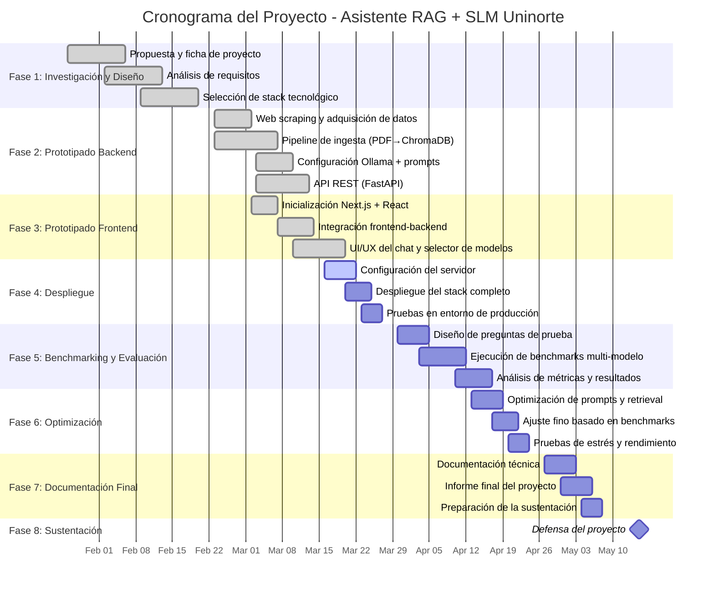

# ProyectoFinal-SLM-UNINORMA

# Asistente Virtual Basado en Small Language Model (SLM) para la Consulta de Normatividad de Uninorte

---

## 1. Introducción

El acceso eficiente a la normatividad institucional es un reto recurrente en entornos universitarios. Actualmente, la Universidad del Norte publica su marco normativo exclusivamente en formato digital (principalmente PDFs) en su [portal oficial de normatividad](https://www.uninorte.edu.co/web/sobre-nosotros/normatividad), abarcando reglamentos estudiantiles, estatutos y lineamientos académicos y administrativos. Esta dispersión y extensión de información complejizan la consulta ágil y precisa, generando retrasos y sobrecarga en las áreas administrativas.

En este contexto, se propone el diseño y desarrollo de un asistente virtual, basado en un Small Language Model (SLM) local y una arquitectura de Retrieval-Augmented Generation (RAG), que permita consultar la normatividad institucional en lenguaje natural de forma segura, privada y eficiente.

---

## 2. Planteamiento del Problema

La comunidad universitaria enfrenta dificultades para encontrar respuestas rápidas y exactas sobre normatividad institucional debido a:
- La gran cantidad de documentos independientes, de considerable extensión, en formatos no estructurados (PDF).
- La falta de un motor de búsqueda semántica que relacione una consulta en lenguaje natural con el fragmento normativo relevante.
- El tiempo perdido por estudiantes y personal al buscar manualmente entre los documentos, lo que a su vez incrementa las consultas repetitivas a las secretarías académicas.

**Problema principal:**  
*La carencia de un sistema automatizado que permita resolver consultas sobre la normatividad universitaria, basada exclusivamente en los documentos oficiales disponibles, impacta negativamente la autogestión y genera sobrecarga administrativa*.

---

## 3. Restricciones y Supuestos de Diseño

### 3.1. Restricciones

- **Restricción de alcance:**  
  El asistente solo consultará documentos de la URL oficial de normatividad de Uninorte (`https://www.uninorte.edu.co/web/sobre-nosotros/normatividad`).  
- **Recursos computacionales:**  
  El sistema debe ejecutarse en servidores locales con hardware limitado (sin depender de APIs externas como OpenAI/Google).
- **Privacidad y seguridad:**  
  No se permitirá la integración con servicios en la nube externos para procesamiento del lenguaje o almacenamiento.
- **Fuentes de datos:**  
  Solamente se utilizarán los documentos PDF vigentes descargados de la URL definida.
- **Alucinaciones:**  
  El sistema debe limitar sus respuestas al contenido recuperado. Si la respuesta no está en la normatividad, debe indicarlo explícitamente.
- (COMPLETAR si existe otra restricción específica derivada de requerimientos del tutor o de recursos disponibles).

### 3.2. Supuestos

- Los documentos descargados son oficiales, actualizados y públicos.
- Las consultas estarán en español y el modelo SLM seleccionado será ajustado para ese idioma.
- Es posible la extracción programática completa de texto legible de todos los PDFs.
- (COMPLETAR otros supuestos relevantes detectados por el equipo).

---

## 4. Alcance

### 4.1. Incluye

- Extracción automatizada y actualización de los documentos PDF de la página oficial de normatividad.
- Procesamiento semántico mediante técnicas de RAG empleando un SLM open source (ej. Llama 3, Phi-3).
- Motor de búsqueda interno que relacione una consulta con la sección normativa pertinente, citando el documento fuente.
- Interfaz de usuario simple de tipo chat (web), accesible desde un navegador de la red interna.
- Reporte y documentación del diseño, la arquitectura y los resultados de pruebas.

### 4.2. No incluye

- Integración con sistemas de autenticación de Uninorte.
- Gestión o validación jurídica de respuestas.
- Procesamiento de trámites administrativos (solo consultas informativas).
- Despliegue a escala institucional ni soporte a consultas fuera del marco de la normatividad oficial.

---

## 5. Objetivos

### 5.1. Objetivo general

Diseñar y desarrollar un prototipo de asistente virtual, basado en un Small Language Model (SLM) y arquitectura RAG, para facilitar la consulta automática y precisa de la normatividad institucional de Uninorte a través de lenguaje natural.

### 5.2. Objetivos específicos

- Investigar y seleccionar las tecnologías apropiadas de extracción de texto y vectorización para documentos PDF normativos.
- Configurar y adaptar un SLM open source capaz de ejecutarse localmente, compatible con español.
- Implementar un motor de búsqueda semántica y pipeline de RAG para consultas normativas.
- Desarrollar una interfaz de usuario básica para la interacción y visualización de resultados.
- Evaluar la precisión y utilidad del sistema usando conjuntos de consultas de prueba y criterios de aceptación previamente definidos.

---

## 6. Criterios de aceptación iniciales

- El sistema debe responder correctamente al menos el X% (COMPLETAR: definir métrica inicial, ej. 80%) de un set de consultas predefinidas validadas por usuarios internos.
- Cada respuesta debe incluir la referencia (documento, artículo, sección) que respalda la información suministrada.
- El sistema debe operar completamente offline dentro de la infraestructura local y no enviar datos sensibles fuera de la universidad.
- Debe manejar correctamente la situación “no respuesta” cuando la normativa no contemple la pregunta.
- (COMPLETAR: definir otros criterios prácticos sugeridos por el tutor/equipo).

---

## 7. Estado del arte y soluciones relacionadas

Soluciones similares han sido implementadas en el ámbito educativo, aunque generalmente empleando modelos en la nube. Destacan:
- **Chatbots FAQ institucionales** con RAG sobre bases documentales cerradas [1].
- **Asistentes para consulta de normativa académica** en instituciones como la Universidad Nacional de Colombia y la Universidad de los Andes [2]–[3].

El uso de SLMs locales representa una ventaja en privacidad y eficiencia de costos frente a LLMs de uso general ([1], [4]).

---

## 8. Cronograma de Trabajo

**Equipo:** Carlos Mendoza, Jesús De la Cruz, Juan José Aragón
**Periodo:** Semestre 2026-1 (Ene 26 – May 15, 16 semanas) | Sustentación: May–Jun 2026

### Detalle por fase

| Fase | Semanas | Periodo | Actividades | Estado | Responsable |
|------|---------|---------|-------------|--------|-------------|
| **1. Investigación y Diseño** | 1–4 | Ene 26 – Feb 20 | Propuesta de proyecto, ficha, análisis de requisitos, selección de tecnologías (Ollama, LangChain, ChromaDB, sentence-transformers) | ✅ Completada | Todos |
| **2. Prototipado Backend** | 5–7 | Feb 23 – Mar 13 | Web scraping de normatividad Uninorte, pipeline de ingesta PDF→chunks→ChromaDB, configuración Ollama + prompt engineering, API REST con FastAPI | ✅ Completada | Todos |
| **3. Prototipado Frontend** | 6–8 | Mar 2 – Mar 20 | Inicialización Next.js + React + Tailwind CSS, integración frontend↔backend via proxy API, interfaz de chat con selector de modelos SLM | ✅ Completada | Todos |
| **4. Despliegue** | 8–9 | Mar 16 – Mar 27 | Configuración del servidor de despliegue (cluster/Azure/OpenLab), despliegue del stack completo (Ollama + backend + frontend), pruebas en entorno de producción | 🔄 En curso | Todos |
| **5. Benchmarking y Evaluación** | 10–12 | Mar 30 – Abr 17 | Diseño del set de preguntas de prueba con ground truth, ejecución de benchmarks multi-modelo (qwen2.5:3b, llama3.2, phi3, etc.), análisis de métricas (latencia, precisión, alucinaciones, tok/s) | ⏳ Pendiente | Todos |
| **6. Optimización** | 12–13 | Abr 13 – Abr 24 | Optimización de prompts y parámetros de retrieval, ajuste fino basado en resultados del benchmarking, pruebas de estrés y rendimiento | ⏳ Pendiente | Todos |
| **7. Documentación Final** | 14–15 | Abr 27 – May 8 | Documentación técnica completa, elaboración del informe final, preparación de la sustentación | ⏳ Pendiente | Todos |
| **8. Sustentación** | 16+ | May – Jun 2026 | Defensa del proyecto ante el jurado | ⏳ Pendiente | Todos |

### Hitos principales

| Hito | Fecha estimada | Entregable |
|------|---------------|------------|
| Informe 1 (estructura + propuesta) | Mar 5 ✅ | README.md con secciones 1-8 |
| Cronograma v1 | Mar 11 ✅ | Branch `crono1` con cronograma Gantt |
| Prototipo funcional desplegado | Mar 27 | Sistema accesible en servidor |
| Resultados de benchmarking | Abr 17 | Métricas comparativas de modelos SLM |
| Informe final | May 8 | Documento completo del proyecto |
| Sustentación | May–Jun | Defensa ante jurado |

---
