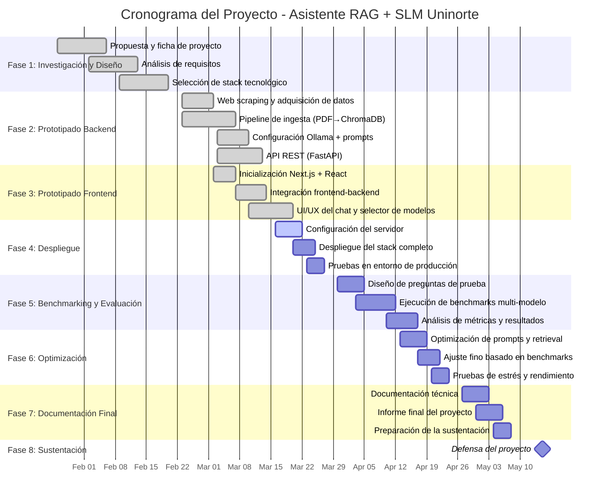

# ProyectoFinal-SLM-UNINORMA

# Informe 1: Asistente Virtual Basado en Small Language Model (SLM) para la Consulta de Normatividad de Uninorte 

---

## 1. Introducción

El acceso eficiente a la información institucional es un pilar fundamental en las instituciones de educación superior. Tradicionalmente, la normatividad de las universidades se encuentra distribuida en documentos extensos (estatutos, reglamentos, resoluciones), lo que dificulta su consulta ágil por parte de la comunidad académica. Con el advenimiento del Procesamiento de Lenguaje Natural (NLP) y los Modelos de Lenguaje Grande (LLMs), ha surgido un nuevo paradigma de interacción humano-computadora basado en interfaces conversacionales. 

Sin embargo, el uso de LLMs comerciales a través de APIs de terceros plantea desafíos significativos en términos de privacidad de los datos, dependencia de infraestructura externa y costos recurrentes de inferencia. Para mitigar estas problemáticas, este proyecto propone el diseño e implementación de un asistente virtual inteligente basado en la arquitectura Retrieval-Augmented Generation (RAG) (Lewis et al., 2020), combinada con Small Language Models (SLMs). La solución se ejecuta de manera 100% local, empleando técnicas de cuantización para viabilizar el despliegue de modelos de miles de millones de parámetros en hardware de consumo, garantizando soberanía tecnológica, gratuidad y alta precisión semántica en el contexto específico de la Universidad del Norte. 

---

## 2. Planteamiento del Problema

La Universidad del Norte cuenta con un vasto corpus normativo compuesto por reglamentos estudiantiles, políticas académicas y resoluciones administrativas. Actualmente, los estudiantes y funcionarios que requieren resolver dudas específicas deben recurrir a búsquedas basadas en coincidencias léxicas (palabras clave) dentro de plataformas estáticas, o realizar una lectura exhaustiva de documentos PDF (a menudo de decenas de páginas). 

Este enfoque tradicional de recuperación de información presenta las siguientes deficiencias:

- **Falta de comprensión semántica**: Los motores de búsqueda léxicos no logran capturar la intención del usuario ni el contexto de la consulta, fallando frente a la sinonimia o la polisemia. 

- **Sobrecarga cognitiva**: El usuario debe localizar, leer y extraer la respuesta por sí mismo a partir de los documentos recuperados. 

- **Desactualización y fragmentación**: La información se encuentra dispersa en múltiples formatos (web y PDF). 

Se requiere un sistema capaz de comprender el lenguaje natural, recuperar los pasajes exactos dentro del corpus normativo cerrado y sintetizar una respuesta coherente sin incurrir en "alucinaciones" informativas, las cuales representan un riesgo crítico en contextos legales e institucionales. 

---

## 3. Restricciones y Supuestos de Diseño

### 3.1. Restricciones

- **Ejecución 100% local**: La arquitectura no debe depender de servicios en la nube (ej. OpenAI, Anthropic), garantizando la privacidad de los datos y eliminando costos operativos (API calls). 

- **Limitaciones de hardware (Inferencia)**: El modelo generativo debe ser un Small Language Model (SLM) capaz de ejecutarse en memoria RAM/VRAM de hardware de grado consumidor. Por tanto, se restringe el uso al modelo Qwen 2.5:3b (3.1 billones de parámetros) aplicando cuantización Q4_K_M a través del motor Ollama. 

- **Veracidad estricta**: El sistema no debe generar conocimiento propio; toda respuesta debe estar fundamentada exclusivamente en los documentos recuperados mediante RAG. 

### 3.2. Supuestos

- El corpus documental de 25 fuentes (20 PDFs y 5 páginas web) procesado en 907 chunks constituye una muestra representativa y suficiente para validar el prototipo funcional. 

- Los usuarios interactuarán con el sistema utilizando el idioma español. 

---

## 4. Alcance

### 4.1. Incluye

- El proyecto abarca el ciclo de vida completo de la solución de software, incluyendo: 

- Construcción de un pipeline de ingesta automatizado mediante web scraping (BeautifulSoup4) y extracción de texto desde PDFs. 

- Estrategia de chunking semántico (RecursiveCharacterTextSplitter) y vectorización mediante el modelo de embeddings paraphrase-multilingual-MiniLM-L12-v2. 

- Implementación de una base de datos vectorial local (ChromaDB) para la recuperación de información. 

- Orquestación del flujo RAG mediante LangChain (LCEL) y FastAPI. 

- Despliegue del modelo generativo local (Qwen 2.5:3b) mediante Ollama. 

- Desarrollo de una interfaz de usuario web moderna e interactiva utilizando Next.js 16 (App Router), React y Tailwind CSS. 

### 4.2. No incluye

- No se contempla la integración del asistente en los sistemas core de producción de la universidad en esta fase de pregrado. 

- El sistema no proporcionará asesoría legal vinculante; sus respuestas son de carácter informativo. 

---

## 5. Objetivos

### 5.1. Objetivo general

Diseñar e implementar un asistente virtual basado en la arquitectura de Generación Aumentada por Recuperación (RAG) y Modelos de Lenguaje Reducidos (SLM) de ejecución local, para facilitar la consulta en lenguaje natural de la normatividad institucional de la Universidad del Norte. 

### 5.2. Objetivos específicos

- Desarrollar un pipeline de procesamiento e ingesta de datos no estructurados (PDFs y HTML) que permita la segmentación (chunking) y representación vectorial del corpus normativo de la institución. 

- Implementar un motor de búsqueda semántica utilizando ChromaDB y modelos de embeddings multilingües, optimizado para el contexto normativo colombiano. 

- Integrar y configurar un SLM de 3.1 billones de parámetros (Qwen 2.5:3b) ejecutado localmente, afinando el prompt engineering para mitigar las alucinaciones en un entorno RAG cerrado. 

- Construir una API RESTful escalable y una interfaz de usuario moderna orientada a la usabilidad, que permita la interacción fluida entre el usuario final y el motor RAG. 

---

## 6. Estado del arte y marco teórico

El enfoque dominante para la mitigación de alucinaciones en LLMs orientados a dominios específicos es el marco Retrieval-Augmented Generation (RAG), introducido formalmente por Lewis et al. (2020) [VERIFICAR FUENTE: NeurIPS 2020]. RAG desacopla el conocimiento paramétrico (almacenado en los pesos del modelo) del conocimiento no paramétrico (una base de datos externa), permitiendo la actualización de la información sin necesidad de reentrenar (o aplicar fine-tuning) al modelo base. 

Para la recuperación semántica, los modelos de transformadores basados en la arquitectura BERT han demostrado ser superiores a los métodos léxicos tradicionales (como BM25). Específicamente, el uso de Sentence-BERT (Reimers & Gurevych, 2019) permite derivar incrustaciones (embeddings) densas computacionalmente eficientes que capturan el significado de las oraciones. El modelo paraphrase-multilingual-MiniLM-L12-v2 se posiciona como una solución óptima para procesar la polisemia legal en español manteniendo una latencia baja en la vectorización. 

En los últimos dos años, la literatura académica ha explorado la democratización de la IA generativa mediante Small Language Models (SLMs). Investigaciones recientes sugieren que modelos en el rango de 1B a 7B de parámetros, cuando se especializan mediante RAG, pueden igualar el rendimiento de modelos masivos (>70B) en tareas de razonamiento deductivo cerrado, reduciendo exponencialmente la huella computacional. La cuantización (ej. reducción de precisión de coma flotante de 16 bits a enteros de 4 bits - Q4_K_M) es la técnica fundamental que permite que estos modelos se desplieguen eficientemente en memoria unificada de bajo costo sin una pérdida significativa de perplejidad.

## 7. Propuesta de solución (Alto nivel)

El sistema se estructura en una arquitectura modular dividida en dos fases principales: 

- **Pipeline de Ingesta y Vectorización (Offline)**: 

  a. Los 25 documentos fuente pasan por un proceso de limpieza y extracción. 

  b. RecursiveCharacterTextSplitter divide el texto en 907 chunks manteniendo la coherencia de los párrafos. 

  c. El modelo sentence-transformers convierte cada chunk en un vector denso. 

  d. Los vectores y su metadata (fuente, página, enlace) se indexan en ChromaDB. 

- **Pipeline de Inferencia RAG (Online)**: 

  a. **Frontend (Next.js 16)**: Captura la consulta del usuario en lenguaje natural. 

  b. **Backend (FastAPI + LangChain)**: Recibe la consulta, genera su embedding y realiza una búsqueda de similitud del coseno en ChromaDB para obtener los fragmentos normativos más relevantes (Top-K). 

  c. **Generación (Ollama + Qwen 2.5:3b)**: Un prompt de sistema estricto (system prompt) combina la consulta del usuario con el contexto recuperado. El SLM procesa esta matriz y sintetiza una respuesta precisa, citando invariablemente las fuentes provistas en el contexto.

### 7.1. Descripción general de la arquitectura
El sistema adopta una arquitectura de tipo Cliente-Servidor orientada a microservicios en un entorno de ejecución 100% local (Local-first/On-Premise). El enfoque general de la solución busca aislar el conocimiento paramétrico del no paramétrico mediante la arquitectura RAG, priorizando la soberanía de los datos institucionales. En contraste con arquitecturas basadas en *Backend as a Service* (BaaS) o que dependen fuertemente de APIs en la nube de terceros, esta propuesta desacopla el motor de inferencia generativa del orquestador del flujo, garantizando privacidad total y gratuidad operativa.

### 7.1.2. Componentes del sistema e interacción
Para cumplir con los requerimientos funcionales y no funcionales, el sistema se divide en los siguientes componentes principales:

- **Frontend (Next.js 16, React, Tailwind CSS):** Actúa como la capa de presentación. Su responsabilidad es capturar la consulta del usuario en lenguaje natural y renderizar los flujos de texto y metadatos de las fuentes.
- **API Core / Backend (FastAPI):** Expone los *endpoints* RESTful. Es responsable de la recepción de solicitudes, la validación de *payloads* y el enrutamiento interno.
- **Orquestador RAG (LangChain):** Componente middleware responsable de la lógica central. Se encarga de aplicar las técnicas de *chunking*, instanciar el modelo de *embeddings* (paraphrase-multilingual-MiniLM-L12-v2) y construir el *System Prompt* inyectando el contexto recuperado.
- **Base de Datos Vectorial (ChromaDB):** Su responsabilidad exclusiva es el almacenamiento de los vectores densos generados en la fase de ingesta y la ejecución eficiente de búsquedas por similitud del coseno.
- **Motor de Inferencia LLM (Ollama + Qwen 2.5:3b):** Servicio subyacente responsable de ejecutar la cuantización (Q4_K_M) y generar la respuesta en lenguaje natural basada estrictamente en el contexto entregado.

**Diagrama de Arquitectura del Sistema:**

### 7.1.3. Interacción entre módulos
El sistema minimiza el grado de interdependencia mediante flujos de datos unidireccionales y el uso de abstracciones:

1. El **Frontend** envía la consulta del usuario mediante una petición HTTP al **Backend (FastAPI)**.
2. El Backend delega el control al **Orquestador (LangChain)**, el cual transforma el texto en un vector denso.
3. LangChain consulta a **ChromaDB**, extrayendo el *Top-K* de fragmentos normativos con mayor proximidad semántica.
4. LangChain ensambla el *prompt* estructurado (Consulta + Fragmentos) y lo transmite al **Motor Ollama**.
5. Ollama retorna los *tokens* generados mediante *streaming*, flujo que atraviesa la arquitectura de regreso hasta el Frontend.

Este diseño exhibe un bajo nivel de acoplamiento; la estandarización de LangChain otorga una alta facilidad de sustitución de componentes. Si en fases posteriores se requiere migrar de ChromaDB a Milvus, o de Qwen a la familia Llama, el cambio no afectará la capa de presentación.

**Diagrama de Interacción y Secuencia:**

### 7.1.4. Análisis de Comportamiento
Al someter las secuencias principales de esta arquitectura a evaluación:
- **Eficiencia del flujo:** El diseño elimina los tiempos muertos por latencia de red externa, lo cual suprime pasos innecesarios de validación de tokens de APIs comerciales.
- **Cuellos de botella:** El límite físico de la arquitectura reside en el *Throughput* del hardware local. La generación de tokens del SLM (Qwen 2.5:3b) monopoliza la VRAM/RAM, lo que representa un cuello de botella directo frente a cargas concurrentes simultáneas.
- **Desacoplamiento:** La interacción entre módulos refleja una cohesión alta y un desacoplamiento eficiente, aislando el procesamiento computacional pesado (vectorización e inferencia) de la gestión de red (FastAPI).

### 7.1.5. Cierre
La arquitectura aquí expuesta responde directamente a las restricciones del problema planteado: el acceso ineficiente y disperso a la normatividad institucional. Las decisiones de diseño documentadas reflejan una integración que prioriza la viabilidad técnica en hardware de consumo. Su principal fortaleza radica en la implementación de un pipeline 100% *On-Premise*, asegurando que la soberanía de los datos de la institución no se vea comprometida, manteniendo la latencia operativa contenida y garantizando la modularidad necesaria para escalar o refactorizar sin reescribir la lógica de negocio fundamental.

## 8. Requerimientos preliminares

- **RF01**: El sistema debe procesar consultas escritas en lenguaje natural en español. 

- **RF02**: El sistema debe devolver una respuesta textual basada única y exclusivamente en el marco normativo pre-cargado. 

- **RF03**: El sistema debe exponer junto a su respuesta las fuentes de donde extrajo la información (nombre del documento, enlace o página). 

 **RNF01**: Toda la arquitectura (vector store, LLM, API, UI) debe ejecutarse localmente sin conexión a internet externa para inferencia. 

- **RNF02**: El modelo de embeddings debe ser capaz de procesar contexto multilingüe con énfasis en idioma español.

## 9. Criterios de aceptación iniciales

- **Precisión de recuperación**: El sistema logra traer el fragmento normativo correcto en el Top-3 de resultados de ChromaDB para al menos el 85% de un set de preguntas de validación. 

- **Mitigación de alucinación**: El asistente responde "No poseo información en los documentos institucionales proporcionados para responder su consulta" cuando se le pregunta sobre temas externos a la universidad. 

- **Rendimiento**: El tiempo total de respuesta (desde el envío de la consulta hasta el inicio del streaming de tokens de salida) no supera los 5-8 segundos en el entorno de desarrollo local. 

## 10. Plan de trabajo

- **Fase 1**: Recolección de normatividad, diseño del pipeline de extracción y chunking (BeautifulSoup, PyPDF2). 

- **Fase 2**: Implementación del Vector Store (ChromaDB) y evaluación empírica de modelos de embeddings locales. 

- **Fase 3**: Despliegue de Ollama, integración del SLM Qwen 2.5:3b y diseño de la cadena RAG con LangChain (FastAPI). 

- **Fase 4**: Desarrollo del Frontend en React/Next.js e integración mediante API REST. 

- **Fase 5**: Pruebas de estrés, validación de fidelidad semántica (ground truth testing) y consolidación del informe final de proyecto.

---

## 11. Cronograma de Trabajo

**Equipo:** Carlos Mendoza, Jesús De la Cruz, Juan José Aragón
**Periodo:** Semestre 2026-1 (Ene 26 – May 15, 16 semanas) | Sustentación: May–Jun 2026

### Detalle por fase

| Fase | Semanas | Periodo | Actividades | Estado | Responsable |
|------|---------|---------|-------------|--------|-------------|
| **1. Investigación y Diseño** | 1–4 | Ene 26 – Feb 20 | Propuesta de proyecto, ficha, análisis de requisitos, selección de tecnologías (Ollama, LangChain, ChromaDB, sentence-transformers) | ✅ Completada | Todos |
| **2. Prototipado Backend** | 5–7 | Feb 23 – Mar 13 | Web scraping de normatividad Uninorte, pipeline de ingesta PDF→chunks→ChromaDB, configuración Ollama + prompt engineering, API REST con FastAPI | ✅ Completada | Todos |
| **3. Prototipado Frontend** | 6–8 | Mar 2 – Mar 20 | Inicialización Next.js + React + Tailwind CSS, integración frontend↔backend via proxy API, interfaz de chat con selector de modelos SLM | ✅ Completada | Todos |
| **4. Despliegue** | 8–9 | Mar 16 – Mar 27 | Configuración del servidor de despliegue (cluster/Azure/OpenLab), despliegue del stack completo (Ollama + backend + frontend), pruebas en entorno de producción | 🔄 En curso | Todos |
| **5. Benchmarking y Evaluación** | 10–12 | Mar 30 – Abr 17 | Diseño del set de preguntas de prueba con ground truth, ejecución de benchmarks multi-modelo (qwen2.5:3b, llama3.2, phi3, etc.), análisis de métricas (latencia, precisión, alucinaciones, tok/s) | ⏳ Pendiente | Todos |
| **6. Optimización** | 12–13 | Abr 13 – Abr 24 | Optimización de prompts y parámetros de retrieval, ajuste fino basado en resultados del benchmarking, pruebas de estrés y rendimiento | ⏳ Pendiente | Todos |
| **7. Documentación Final** | 14–15 | Abr 27 – May 8 | Documentación técnica completa, elaboración del informe final, preparación de la sustentación | ⏳ Pendiente | Todos |
| **8. Sustentación** | 16+ | May – Jun 2026 | Defensa del proyecto ante el jurado | ⏳ Pendiente | Todos |

## 12. Diagramas

## 13. Referencias

- Lewis, P., Perez, E., Piktus, A., Petroni, F., Karpukhin, V., Goyal, N., ... & Kiela, D. (2020). Retrieval-augmented generation for knowledge-intensive nlp tasks. Advances in Neural Information Processing Systems, 33, 9459-9474. 

- Reimers, N., & Gurevych, I. (2019). Sentence-BERT: Sentence Embeddings using Siamese BERT-Networks. Proceedings of the 2019 Conference on Empirical Methods in Natural Language Processing and the 9th International Joint Conference on Natural Language Processing (EMNLP-IJCNLP), 3982-3992. [VERIFICAR FUENTE: Enlace a ACL Anthology]. 

- LangChain AI. (2024). LangChain Documentation: Chains, Retrieval, and Agents. Recuperado de la documentación oficial. 

- Qwen Team. (2024). Qwen2.5 Technical Report.  

- Anthropic. (2024). Claude (Versión 4.6 Sonnet) [Modelo de lenguaje grande]. https://claude.ai

- Google. (2026). Gemini (Versión 3.1 Pro) [Modelo de lenguaje grande]. https://gemini.google.com
---
